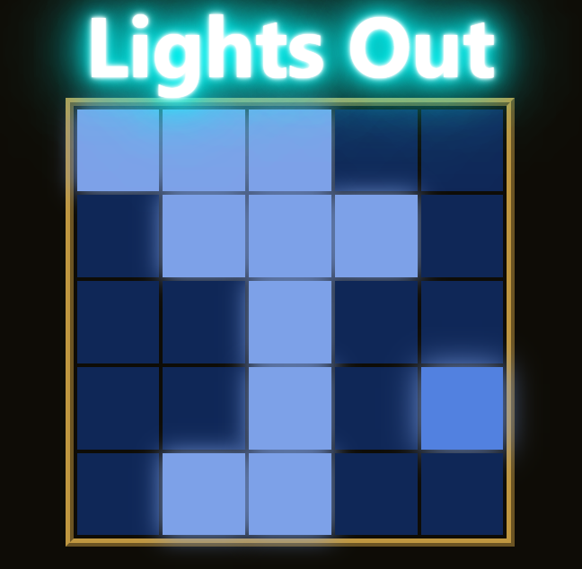

# Lights Out

## Description

This React application displays a game called Lights Out. In this game, the goal is to make all lights of a board to be turned off. The user can click any light to toggle it on, if it is off, or off, if it is on, but some neighbours of that light will also be toggled. Here's a preview of the game:

## How to run it:

After downloading this repository files, open a command window of your choice and execute the following command inside Lights-Out-Game folder:

### `npm install` 

Then execute:

### `npm start`

After some moments, your browser window should open with the app running. If this does not occur, try accessing it manually by typing http://localhost:3000/ at the top of your browser.
